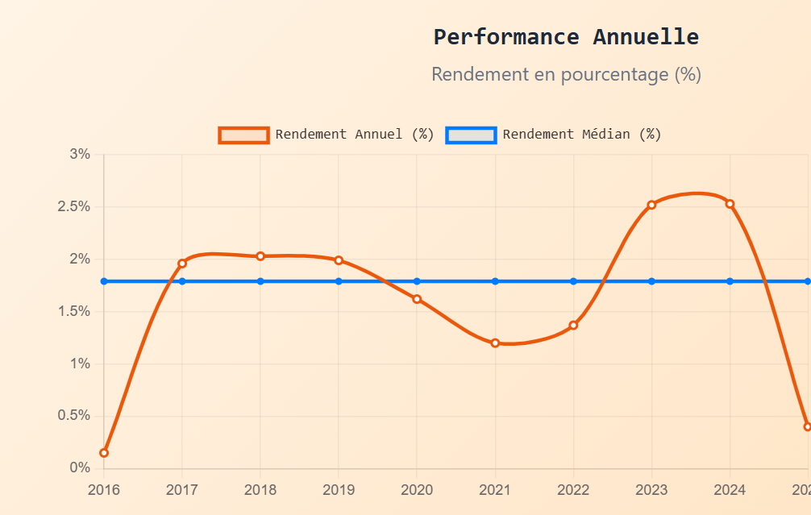

## 🌟 Description
Ce projet est une application qui permet de recommander des OPCVM aux clients selon leurs rendements avec une interface intuitive et moderne.

## 🎯 Fonctionnalités
✔️ Registration
✔️ Login
✔️ Consulter les differents OPCVM 
✔️ Visualiser les renedements annuels 

## 📸 Aperçu
Voici un aperçu de l’application en action :

{width=400px}
{width=400px}
{width=400px}
{width=400px}
{width=400px}

